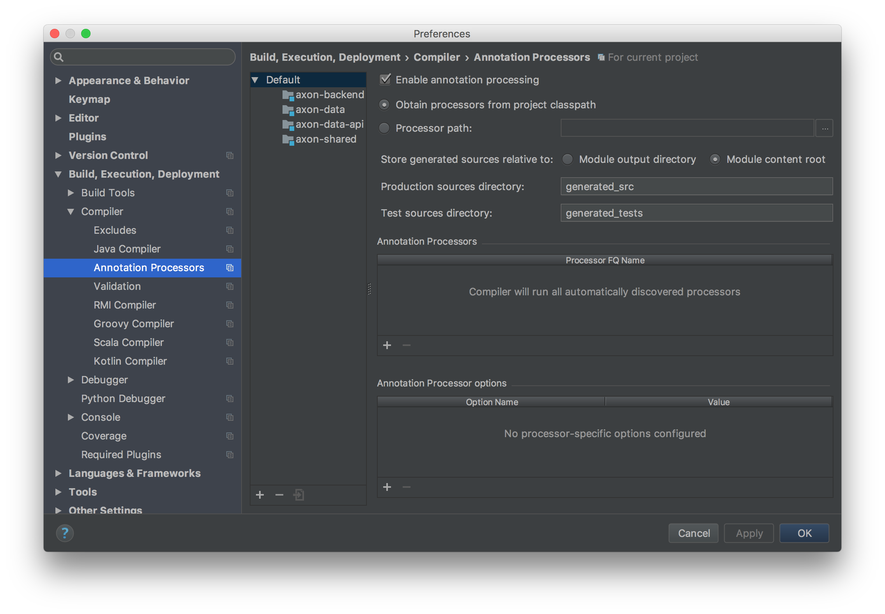

# Axon Backend

This is the backend project.

## Setup for Contributing

1. Use IntelliJ. You can get Pro version for free with your .edu email
2. Run `./gradlew idea` from this directory.
3. Open this project in Intellij.
4. Go to settings, `Annotation Processors`. Mark it as enabled, select `Module Content Root`, and make sure you have `generated_src` and `generated_tests`:


## Running the services

To run the Data service:

```
./gradlew axon-data:run
```
